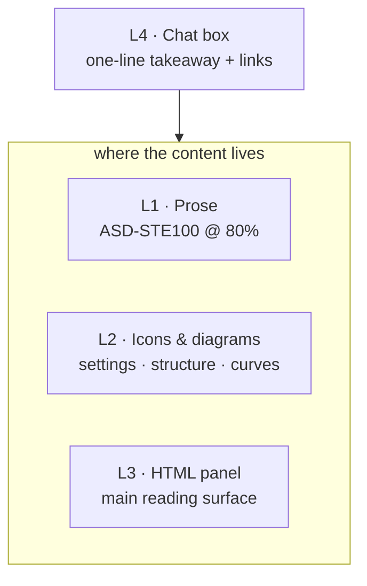

# report-to-human

**让你的 Agent 学会 REPORT TO HUMAN。让 AI 说人话。**

A 4-layer reporting protocol for AI agents, inspired by [Karpathy's output ladder](https://x.com/karpathy/status/2105819303471976479) (2026-10-02): writing → diagrams → HTML → video.

Your agent should not dump three screens of markdown into the chat box. The chat box is the thinnest layer. The content lives in the layers above it.

| Layer | Carries | Rule |
| --- | --- | --- |
| **L1 Prose** | reports & analysis | ASD-STE100 at **80% strictness** — the controlled language built for aircraft maintenance manuals. Short sentences, one name per concept, active voice, every number and qualifier preserved |
| **L2 Icons & diagrams** | settings & structure | config as one row of icon + name + value (monochrome line icons in HTML), structure as diagrams, curves as figures |
| **L3 HTML panel** | the main reading surface | one self-contained HTML file built from `assets/panel-template.html`: first screen, one finding per section, sample browser |
| **L4 Chat box** | entry point only | name + one-line takeaway + panel link + report link. Nothing else |



## Why ASD-STE100?

ASD-STE100 is the controlled language the aerospace industry built so a mechanic anywhere in the world reads a step once and gets it right: ~900 approved words, one meaning each, short sentences, active voice, one instruction per sentence. Karpathy's tip: ask for **"80% of the way to ASD-STE100"** — keep the discipline, relax the vocabulary lockdown. It fixes the exact things AI prose breaks: synonym rotation (worker → agent → executor), hedge stacks (should/might/could), 60-word sentences, and decorative filler.

Full rule profile: [`references/asd-ste100-80.md`](references/asd-ste100-80.md).

## Install

Easiest: paste this sentence to Codex or Claude Code / 把这句话发给 Codex 或 Claude Code：

> 帮我安装这个 skill：github.com/guoshaoyang-pku/report-to-human

**For the agent doing the install:** clone this repo into the skills directory of the host, keeping the folder name `report-to-human`, then tell the user to start a new session.

| Host | Skills directory |
| --- | --- |
| Claude Code | `~/.claude/skills/report-to-human` |
| Codex | `$CODEX_HOME/skills/report-to-human` (default `~/.codex/skills/report-to-human`) |
| Other skill-loading agents | that agent's skills directory |

Manual install:

```bash
npx skills add guoshaoyang-pku/report-to-human    # project-level, any skills-CLI host (Codex, Claude Code, ...)
git clone https://github.com/guoshaoyang-pku/report-to-human ~/.claude/skills/report-to-human   # Claude Code, global
git clone https://github.com/guoshaoyang-pku/report-to-human ~/.codex/skills/report-to-human    # Codex, global
```

Then just say: **"跟我汇报"** / **"report to human"** / "brief me on this run in 4 layers".

## Repo layout

```
SKILL.md                              # the protocol, Chinese edition (what agents load)
docs/SKILL.en.md                      # the protocol, English edition
assets/panel-template.html            # minimal panel template, Anthropic palette
scripts/panel_audit.py                # pre-delivery check: extra elements + unexplained terms
scripts/panel_style.py                # shared matplotlib style for panel figures
scripts/plot_run_metrics.py           # reward/seqlen/clip figures from any log_history.json
references/asd-ste100-80.md           # 80% rule profile + open-source survey
references/domain-example-rl-trial.md # worked example: RL training-run analysis
```

## What's new in v2

Built from real use. Three panels made with v1 were more readable, but shared three problems.

1. **Minimalism.** Subtitles, KPI cards, section numbers, PID/status/snapshot lines, and "view Markdown" buttons are deleted by default. The first screen is exactly: title + one-sentence conclusion + settings row.
2. **Explain before use.** Project codenames, run IDs, and formula symbols get a plain-language explanation where they first appear. The title and first screen contain zero unexplained terms.
3. **Looks.** One panel template (Anthropic brand palette and type), monochrome line icons instead of color emoji in HTML, and one figure style that follows the Orchestra academic-plotting rules.

`scripts/panel_audit.py` checks rules 1 and 2 before delivery.

## Reader language

`SKILL.md` is the Chinese edition: reports default to Chinese, technical terms stay in English, and the agent switches to the user's language when the user writes in another one. For an English-first install, copy `docs/SKILL.en.md` over `SKILL.md`. Both editions apply the same sentence discipline.

---

## 中文说明

**report-to-human：4 层汇报体系。** 一切"给人看"的产出按 4 层组织，聊天框是最后、最薄的一层。

- **L1 文字层**：用 ASD-STE100 的 80% 严格性写散文——航空维修手册级的受控语言。短句、一个概念一个名字、主动语态、数字和限定词全保留。治好 AI 输出的老毛病：同义词轮换、should/might 堆叠、60 词长句、装饰性废话。
- **L2 图标/图示层**：settings 用一行“图标 + 名称 + 值”展示（HTML 里用单色线性图标），结构用图，曲线出图，不靠散文交代配置。
- **L3 HTML panel 层**：主阅读面。单文件自包含 HTML：settings chip、主曲线、结论区、样本浏览器。有现成 dashboard 就直接用。
- **L4 聊天框层**：只留入口——名称 + 一句话结论 + panel 链接 + 报告链接。不贴正文，不堆表格。

来源：Karpathy 2026-10-02 的输出阶梯（writing → diagrams → HTML → video）。本 skill 把第 2 层落地为 settings 图标化，把第 4 层替换为聊天框入口。

**v2 新增三条硬规则**（来自真实使用：用 v1 做的 3 个 panel 可读性提升了，但仍有共性痛点）：

1. **极简**：副标题、KPI 卡、节编号、PID / 状态 / 快照行、"查看 Markdown"按钮默认删除。首屏只有标题、一句话结论和一行 settings。
2. **术语先解释后使用**：项目代号、run 名、公式符号在第一次出现的地方用平实的话解释。标题和首屏不出现未解释的术语。
3. **好看**：统一 panel 模板（Anthropic 配色与字体），HTML 里用单色线性图标代替彩色 emoji，绘图按 Orchestra academic-plotting 规则统一风格。

交付前用 `scripts/panel_audit.py` 自动检查前两条。

内置领域示例：RL 训练 trial 分析（reward/seqlen/clip 曲线 + 思维链演变抽查 + think-vs-direct 对照臂 + 完整避坑清单），附通用绘图脚本 `scripts/plot_run_metrics.py`（读任何 HF-Trainer 风格的 `log_history.json`）。

## Credits & prior art

- [Karpathy's post](https://x.com/karpathy/status/2105819303471976479) — the ladder.
- [ASD-STE100 Issue 9](https://www.asd-ste100.org/) — the standard behind L1. Not redistributed here; rule items are independent paraphrases from public secondary sources.
- [0xpili/simplified-technical-english](https://github.com/0xpili/simplified-technical-english) · [ashryaagr/karpathy-output-style](https://github.com/ashryaagr/karpathy-output-style) · [danyuchn/asd-ste100-skill](https://github.com/danyuchn/asd-ste100-skill) · [JAICHANGPARK/ASD-STE100](https://github.com/JAICHANGPARK/ASD-STE100) — surveyed implementations, see the table in `references/asd-ste100-80.md`.
- Note: the cheat-sheet image attached to the original tweet contains errors ([fact-check](https://max.nardit.com/articles/karpathy-understanding-llm-outputs)). This repo follows Issue 9, not the image.
- [Anthropic skills · brand-guidelines](https://github.com/anthropics/skills) — panel palette and type.
- [Orchestra AI-Research-SKILLs · academic-plotting](https://github.com/Orchestra-Research/AI-Research-SKILLs) — plotting rules.

## License

MIT — see [LICENSE](LICENSE).
