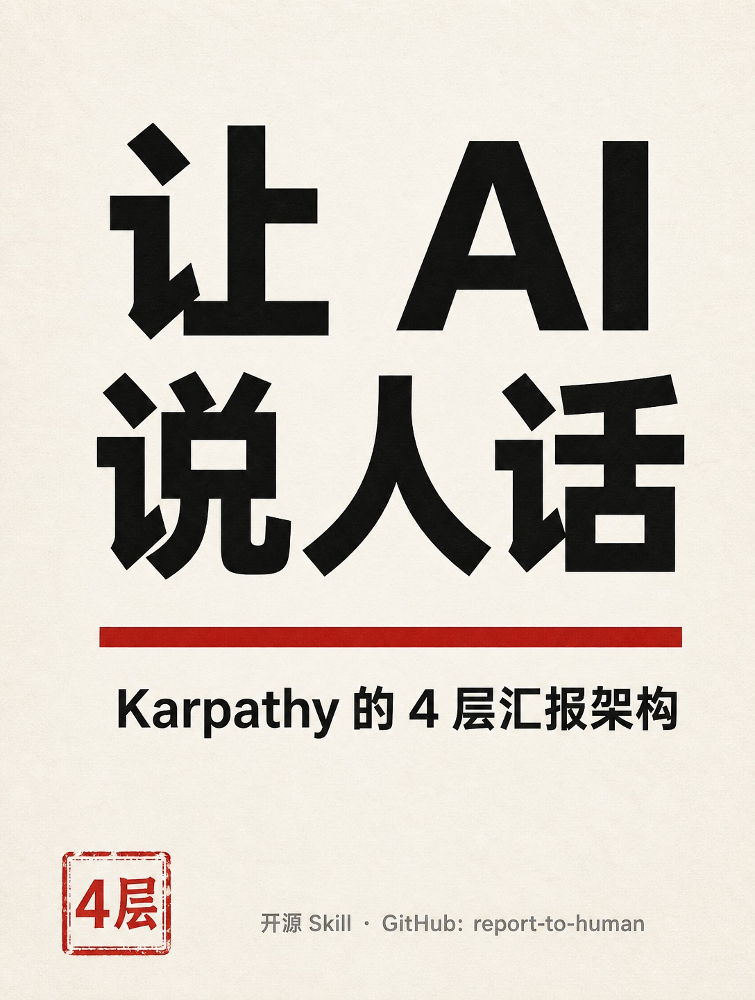
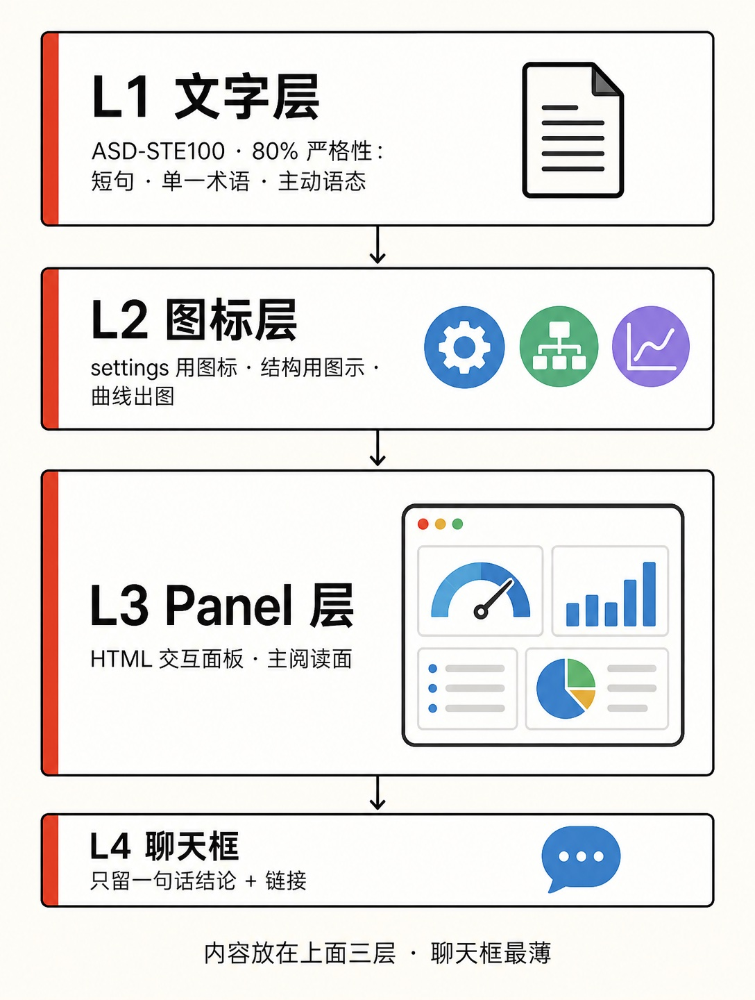
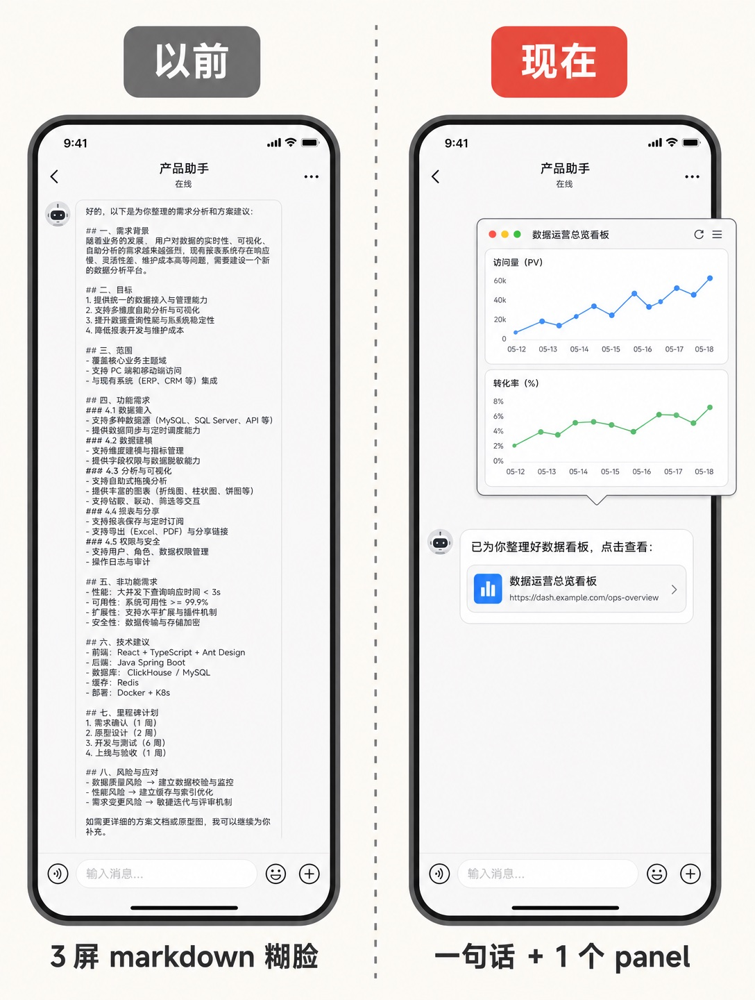

# report-to-human · skill 整合包

三个 skill，一次装齐。都给中文用户：让 agent 的产出人能读、论文能写、报告能上线。

| skill | 干什么 |
| --- | --- |
| **report-to-human** | 向人汇报的 4 层协议：STE 散文、图标化配置、HTML panel、聊天框只留结论。带 panel 模板、统一绘图风格、交付前自检脚本 |
| **research-skills** | Orchestra 论文写作库（12.7k stars）的路由器：写论文、画图、talk、ideation、英文去 AI 味清单。按需拉子 skill，不预载八十个 |
| **blog-deploy** | 把 `docs/` 的单文件产物发布到 GitHub Pages 个人主页；验证 HTTP 200 才算完成 |

<p align="center">
  
  
  
</p>

## 安装

把这句话发给 Codex 或 Claude Code：

> 帮我安装这个仓库里的 skills：github.com/guoshaoyang-pku/report-to-human

**给执行安装的 agent**：clone 本仓库，把 `skills/` 下需要的目录复制到宿主的 skills 目录（文件夹名不变），然后让用户开新会话。

| 工具 | 目录 |
| --- | --- |
| Claude Code | `~/.claude/skills/` |
| Codex | `~/.codex/skills/` |

装好之后说 **"跟我汇报"**、**"写论文"** 或 **"把这个报告发布上线"**。

## 刻意没有做成 skill 的

- **arxiv 检索**：偶发查询用网页搜索就够，单独 skill 只加触发词不加能力。
- **PowerPoint / plan**：宿主 agent 自带。
- **research-paper-writing**：与 research-skills 里的 ml-paper-writing 路由重复，该名字的请求直接落路由器。
- **humanizer**：清单浓缩进 `skills/research-skills/references/de-ai-prose.md`，不单独注册。
- **sketch / claude-design**：已有设计类 skill 覆盖（design-then-build、frontend-slides、frontend-design）。

整合包保持三个 skill：注册项越多，触发越容易互相打扰。

## 仓库

```
skills/report-to-human/    # 4 层汇报协议（中文 SKILL + 英文 docs/SKILL.en.md + 模板 + 自检）
skills/research-skills/    # 论文库路由器 + 英文去 AI 味清单
skills/blog-deploy/        # GitHub Pages 发布与 200 验证
assets/                    # 本页三张展示卡
```

## 其它

- 出处：[Karpathy 2026-10-02 的输出阶梯](https://x.com/karpathy/status/2105819303471976479)；L1 依据 [ASD-STE100 Issue 9](https://www.asd-ste100.org/)；panel 配色来自 [Anthropic brand-guidelines](https://github.com/anthropics/skills)；绘图规则取自 [Orchestra academic-plotting](https://github.com/Orchestra-Research/AI-Research-SKILLs)；去 AI 味清单浓缩自 [blader/humanizer](https://github.com/blader/humanizer)（MIT）。
- MIT，见 [LICENSE](LICENSE)。
